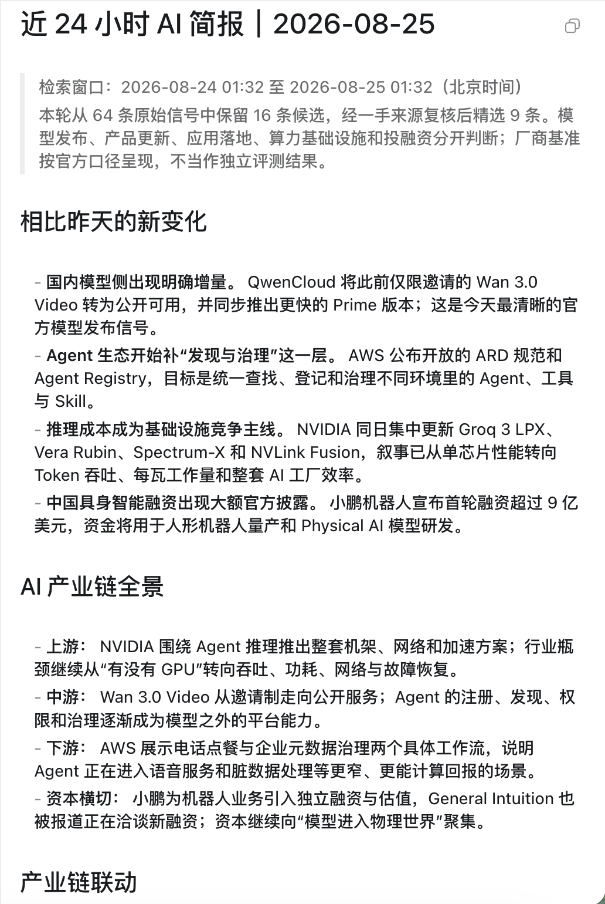
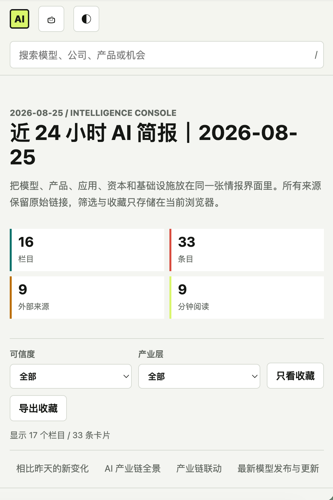

<p align="center">
  <strong>简体中文</strong> | <a href="./README_EN.md">English</a>
</p>

# AI Daily Briefing

给 AI/Web3 自媒体创作者用的每日情报与选题系统。它会从厂商官方源、产业基础设施、应用产品、资本市场、媒体、开发者社区、论文和开源生态收集候选信号，整理成带可点击链接的 Markdown 中文早报和可搜索、筛选、收藏的交互 HTML，并为 Codex 提供可二次精编的结构化候选包。

> **主打用法：在 Codex 里直接输入 `$daily-briefing 生成今日早报`，不需要 Hermes，也不需要打开 Telegram。**

## 两种输出格式

同一份简报会交付可点击的 Markdown 长文和可搜索、筛选、收藏的交互 HTML。HTML 是单文件，手机和桌面浏览器都能直接打开。

<table>
  <tr>
    <th width="50%">Markdown 长文</th>
    <th width="50%">交互 HTML</th>
  </tr>
  <tr>
    <td></td>
    <td></td>
  </tr>
</table>

## Codex 直接调用（推荐）

先克隆项目并安装仓库内置的 Codex Skill：

```bash
git clone https://github.com/Rion-Wu-tech/ai-daily-briefing.git
cd ai-daily-briefing
./scripts/install-codex-skill.sh
```

重新打开一个 Codex 任务后，直接输入：

```text
$daily-briefing 生成今日早报
```

也可以直接指定范围：

```text
$daily-briefing 检索过去 48 小时 AI 赛道爆火热点
$daily-briefing 检索最近 24 小时最新模型发布，只看官方来源
$daily-briefing 生成过去 24 小时 AI 全产业链简报
$daily-briefing 查看最近 7 天 AI 应用落地和投融资
$daily-briefing 生成本周简报复盘
```

Codex 会自动完成抓取、去重、评分和二次精编，最终生成：

```text
outputs/briefing_YYYY-MM-DD.md
outputs/briefing_YYYY-MM-DD.html
```

Markdown 中的新闻标题和来源链接都可以直接点击。HTML 是不依赖服务器和外部 CDN 的单文件阅读器，支持搜索、栏目导航、可信度与产业层筛选、本地收藏、深浅主题、Markdown 下载及打印/PDF。Python 模板负责稳定抓取和兜底，当前 Codex 模型负责最终选稿、中文解释、栏目编排与 X 草稿。

已有同名 Skill 时，显式备份并替换：

```bash
./scripts/install-codex-skill.sh --force
```

## 功能

- AI 热点：TechCrunch、OpenAI、Google DeepMind、Hugging Face 官方更新
- 最新模型发布：独立追踪厂商官网、官方 Changelog、官方模型卡与开源权重首发
- 产品与工具更新：跟踪 AI 产品、新功能、API、价格、工作流与重要集成，不要求必须伴随新模型
- AI 产业链全景：按上游算力与基础设施、中游模型与平台、下游应用与服务组织信号
- 应用层趋势：补充客户采用、用户增长、行业落地、定价、收入和真实商业化证据
- AI 投融资：独立跟踪融资、并购、IPO 和财报，并标注关键数字是否经过官方或多源核验
- 产业链联动：连接跨层共同主题，同时明确区分“主题关联”和真实合作或因果关系
- 可能爆火的 AI 新闻：从公司公告、开源项目、研究突破、融资并购、行业争议和高热社区讨论中筛选传播候选
- 官方模型组织：42 个官方 Hugging Face 组织，重点覆盖中美活跃模型团队
- 官方发布页：19 个基础模型发布页 + 38 个 AI 编程、Agent、多模态和模型平台更新页
- 官方账号雷达：62 个模型公司与 AI 产品 X 官方账号；Codex 可直接检索，配置 X API 后 Python 也能自动抓取
- AI 编程/Agent：单独跟踪 Claude Code、Codex、Cursor、Copilot、Cognition/Devin、Replit、Manus
- 多模态模型：单独跟踪 Runway、Stability AI、FLUX、Midjourney、Luma、Pika、Kling、Vidu
- 补充信号：Hacker News、arXiv、Hugging Face Trending、AI HOT 精选
- 产业信号：自动抓取 NVIDIA、AWS、Google Cloud、Product Hunt、Crunchbase News、TechCrunch Venture、Data Center Dynamics，并把机器之心等无稳定 RSS 的入口交给 Codex 检索
- 中国优先核验：补充 36Kr、IT桔子、港交所披露等检索入口，应用采用和融资数字必须回到一手来源确认
- 官方追踪：Anthropic sitemap，以及 Codex、Claude Code、Gemini CLI、Transformers Releases
- Web3 热点：CoinDesk 最新加密新闻
- 投资 & 经济：TechCrunch Venture 分类新闻
- GitHub 优质项目：GitHub Trending
- 今日选题素材：把热点转成中文内容选题
- Codex 友好：支持 `--dry-run` 离线验证、单元测试和稳定输出目录
- 每条新闻/项目的可点击标题下都会紧跟 1 至 2 句具体中文概括，说明谁做了什么、关键结果或影响；不写空泛模板，也不额外加“摘要”等标签
- Codex 保存早报后会运行 Markdown 质检器，自动拦截缺少中文概括、只有评分/来源或命中空泛模板的条目
- 开头自动生成 `相比昨天的新变化`、`AI 产业链全景`、`产业链联动`、`最新模型发布`、`产品与工具更新`、`应用层趋势`、`AI 投融资与商业化`、`可能爆火的 AI 新闻`、`今日必须看`、`适合发 X`、`B端/商业机会` 和 `持续跟踪`
- 用内容价值、商业价值、个人匹配、时效、可信度五个维度排序，综合分最高 96，避免大量虚高满分
- 可信度区分 `官方确认`、`多源印证`、`单源信号`
- X 草稿覆盖单帖、thread、视觉/视频脚本三种形态
- SQLite 记录首次出现、最后出现、重复次数、来源数和每日排名；同一天重复运行不会重复计数
- 可记录 `阅读 / 收藏 / 写稿 / 已发布 / 没价值`，后续排序会小幅学习你的真实选择
- 每次真实抓取记录来源成功率、条目数和耗时，可生成 7 天来源健康报告
- 自动生成周复盘：持续信号、内容反馈、偏好类别、来源健康度和下周动作
- `--editorial-packet` 生成 Codex 精编包，由当前 Codex 模型做最终选稿和中文改写；Python 模板始终作为确定性兜底
- 仓库内置标准 Codex Skill、UI 元数据和便携 runner；可以从 Codex 直接调用并落盘 Markdown
- Codex 精编 Markdown 通过质检后会生成同名交互 HTML；手工修改过的 Markdown 也可单独重新渲染
- 自动过滤 AI 板块跑题内容，并合并同一链接或相似标题的重复报道
- 媒体与官方源交替混排，单个来源失败时保留其他可用板块
- 早报结尾自动生成简短的中英双语 Star 引导，并保留唯一的官方仓库链接

### 两维情报模型

每条信息同时回答两个问题：

- `industry_layer`：公司或产品位于上游、中游还是下游
- `event_types`：这次发生了模型发布、产品更新、采用增长、融资、并购、财报还是政策变化

资本不是产业链的“第四层”。例如，一家 AI 工作流公司完成融资后，仍属于下游应用，只是同时带有 `funding` 事件。这样既能看清整条产业链，也不会让融资新闻挤掉产品和应用信号。

## 当前官方覆盖

| 区域 | 模型组织/发布源 | X 官方账号 |
| --- | --- | --- |
| 美国 | OpenAI、Anthropic/Claude、Google DeepMind、Meta AI/Llama、xAI/Grok、Microsoft AI/Phi、NVIDIA、Ai2、Amazon Nova、Perplexity、IBM Granite、Salesforce、Snowflake、Liquid AI、Nous Research、Cerebras、Prime Intellect、Inception、Stability AI、Black Forest Labs | `@OpenAI`、`@AnthropicAI`、`@claudeai`、`@GoogleDeepMind`、`@AIatMeta`、`@SpaceXAI`、`@grok`、`@MicrosoftAI`、`@NVIDIAAI`、`@allen_ai`、`@AWSCloud`、`@perplexity_ai`、`@IBMResearch`、`@SalesforceDevs`、`@SnowflakeDB`、`@LiquidAI`、`@NousResearch`、`@Cerebras`、`@PrimeIntellect`、`@_inception_ai`、`@StabilityAI`、`@bfl_ai` |
| 中国 | Qwen、DeepSeek、Z.ai/GLM、Kimi、MiniMax、腾讯混元、字节 Seed、阶跃星辰、百川、01.AI、小米 MiMo、InternLM、百度文心、华为盘古、讯飞星火、商汤日日新、美团 LongCat、快手 Kolors、OpenBMB/MiniCPM、OpenGVLab/InternVL、BAAI、Ant Ling、Wan、Skywork | `@Alibaba_Qwen`、`@deepseek_ai`、`@Zai_org`、`@Kimi_Moonshot`、`@MiniMax_AI`、`@StepFun_ai`、`@ByteDanceSeed`、`@TencentHunyuan`、`@Baidu_Inc`、`@01AI_Yi`、`@BaichuanAI`、`@HuaweiCloud1`、`@SenseTimeGroup`、`@Meituan_LongCat`、`@OpenBMB`、`@BAAIBeijing`、`@AntLingAGI`、`@Alibaba_Wan`、`@Skywork_ai` |
| 其他 | Mistral AI、Cohere Labs | `@MistralAI`、`@cohere` |

| 产品方向 | 官方发布源 | X 官方账号 |
| --- | --- | --- |
| AI 编程/Agent | Claude Code、OpenAI Codex、Cursor、GitHub Copilot、Cognition/Devin、Replit、Manus | `@claudeai`、`@OpenAI`、`@cursor_ai`、`@GitHubCopilot`、`@cognition_labs`、`@Replit`、`@ManusAI` |
| 多模态模型 | Runway、Stability AI、Black Forest Labs/FLUX、Midjourney、Ideogram、Luma、Pika、Adobe Firefly、Kling、Vidu、Wan | `@runwayml`、`@StabilityAI`、`@bfl_ai`、`@midjourney`、`@ideogram_ai`、`@LumaLabsAI`、`@pika_labs`、`@AdobeFirefly`、`@Kling_ai`、`@ViduAI_official`、`@Alibaba_Wan` |
| 音频/音乐模型 | ElevenLabs、Suno | `@ElevenLabs`、`@suno_ai_` |
| 模型平台/生态 | Hugging Face、OpenRouter、Together AI、Snowflake Cortex、Salesforce AI | `@huggingface`、`@OpenRouter`、`@togethercompute`、`@SnowflakeDB`、`@SalesforceDevs` |

官网、Changelog 和模型卡用于确认事实；X 用于捕捉首发、预告、API/价格变更和产品动态。没有配置 X API 时，Codex 会读取精编包中的账号清单并联网检索，不影响直接调用。

若希望本地 Python 自动抓取全部官方账号，可选配置环境变量：

```bash
export X_BEARER_TOKEN="你的 X API Bearer Token"
```

不要把 Token 写进 `config.yaml` 或提交到 Git。

## 快速开始

```bash
git clone https://github.com/Rion-Wu-tech/ai-daily-briefing.git
cd ai-daily-briefing

python3 -m venv .venv
source .venv/bin/activate
python -m pip install -r requirements.txt
```

先跑离线验证：

```bash
python briefing.py --dry-run --no-save
python -m unittest discover -s tests
```

真实抓取并保存 Markdown 简报，标题链接可点击，每条后面跟一行简短中文解释：

```bash
python briefing.py
```

默认输出到：

```text
outputs/briefing_YYYY-MM-DD.md
```

## 本地 Python 运行

不安装 Codex Skill 也可以独立运行：

```bash
python3 -m venv .venv
source .venv/bin/activate
python -m pip install -r requirements.txt
python briefing.py --dry-run --no-save
python -m unittest discover -s tests
```

如果 dry-run 和测试都通过，再跑真实抓取并保存 Markdown：

```bash
python briefing.py
```

更完整的 agent 运行说明见 [CODEX.md](./CODEX.md)。

## 常用命令

```bash
# 离线样例数据，不访问外部网站
python briefing.py --dry-run

# 输出纯文本
python briefing.py --format text

# 输出 JSON，只打印不保存
python briefing.py --format json --no-save

# 直接从结构化数据生成交互 HTML
python briefing.py --format html

# 把 Codex 精编或手工修改后的 Markdown 转成交互 HTML
python skills/daily-briefing/scripts/render-briefing-html.py outputs/briefing_YYYY-MM-DD.md

# 输出 Codex 二次精编候选包
python briefing.py --editorial-packet --output-file outputs/editorial_packet.json

# 检查 Codex 精编后的每条链接是否紧跟具体中文概括
python skills/daily-briefing/scripts/validate-briefing.py outputs/briefing_YYYY-MM-DD.md

# 只看过去 48 小时的模型发布与模型更新
python briefing.py --mode models --hours 48 --format markdown

# 只看过去 7 天 AI 视频赛道的产品与功能更新
python briefing.py --mode products --focus "AI视频" --hours 168 --format markdown

# 只看过去 24 小时的应用落地、采用和增长信号
python briefing.py --mode applications --hours 24 --format markdown

# 只看最近 7 天 AI 融资、并购、IPO 和财报
python briefing.py --mode funding --hours 168 --format markdown

# 生成包含上中下游、跨层联动、应用和资本事件的产业简报
python briefing.py --mode industry --hours 24 --format markdown

# 只看过去 24 小时可能爆火的 Agent 新闻
python briefing.py --mode hotspots --focus "Agent" --hours 24 --format markdown

# 临时调试，不读写跨日历史
python briefing.py --no-save --no-history

# 记录反馈：目标可以是 item_key、完整链接或唯一标题
python briefing.py --feedback "https://example.com/item" --feedback-action saved
python briefing.py --feedback "标题" --feedback-action published --feedback-note "已发 X"
python briefing.py --feedback "标题" --feedback-action dismissed

# 生成最近 7 天周复盘
python briefing.py --weekly-review

# 周复盘只打印，不保存
python briefing.py --weekly-review --no-save

# 指定输出文件
python briefing.py --format markdown --output-file outputs/today.md
```

## 配置

编辑 [config.yaml](./config.yaml)：

```yaml
sources:
  ai_news: "https://techcrunch.com/category/artificial-intelligence/"
  ai_official:
    - name: "OpenAI"
      url: "https://openai.com/news/rss.xml"
    - name: "Google DeepMind"
      url: "https://deepmind.google/blog/rss.xml"
    - name: "Hugging Face"
      url: "https://huggingface.co/blog/feed.xml"
  web3_news: "https://www.coindesk.com/"
  venture_news: "https://techcrunch.com/category/venture/"
  github_trending: "https://github.com/trending"
  hacker_news:
    url: "https://hn.algolia.com/api/v1/search"
    queries: ["AI agent", "LLM", "OpenAI", "Claude"]
  arxiv:
    url: "https://export.arxiv.org/api/query"
    query: "cat:cs.AI OR cat:cs.CL OR cat:cs.LG"
  huggingface_models: "https://huggingface.co/api/models"
  official_model_orgs:
    - name: "OpenAI"
      author: "openai"
    - name: "Meta Llama"
      author: "meta-llama"
    - name: "Qwen"
      author: "Qwen"
    - name: "DeepSeek"
      author: "deepseek-ai"
  model_changelogs:
    - name: "Mistral AI"
      url: "https://docs.mistral.ai/resources/changelogs"
      parser: "mistral"
    - name: "QwenCloud"
      url: "https://docs.qwencloud.com/changelog/models"
      parser: "qwen"
  industry_feeds:
    - name: "NVIDIA Blog"
      url: "https://blogs.nvidia.com/feed/"
      track: "infrastructure"
      layer_hint: "upstream"
      authority: "official"
    - name: "Product Hunt"
      url: "https://www.producthunt.com/feed"
      track: "applications"
      layer_hint: "downstream"
      authority: "community"
      discovery_only: true
    - name: "Crunchbase News"
      url: "https://news.crunchbase.com/feed/"
      track: "capital"
      layer_hint: "downstream"
      authority: "media"
      discovery_only: true
  aihot: "https://aihot.today/ai-news"

output:
  format: "markdown"
  language: "zh"
  output_dir: "outputs"

limits:
  ai_news: 10
  ai_official_per_source: 3
  official_model_releases_per_org: 2
  model_changelog_per_source: 3
  model_releases: 8
  industry_chain_per_layer: 3
  application_trends: 6
  ai_funding: 6
  cross_layer_connections: 3
  web3_news: 3
  venture_news: 5
  github_projects: 10
  topics: 5

quality:
  max_feed_age_days: 10
  model_release_max_age_days: 14
  funding_min_source_count: 2
  similarity_threshold: 0.76
  min_similarity_tokens: 4

history:
  enabled: true
  database: "data/briefing_history.sqlite3"
```

## 输出格式

支持三种格式，默认是 `markdown`：

- `markdown`：默认，带可点击链接，适合文章草稿、公众号、飞书、Obsidian 二次整理
- `text`：适合 Telegram、微信、即时消息
- `json`：适合接到自动化工作流里继续处理

默认 Markdown 结构：

```text
相比昨天的新变化
AI 产业链全景
产业链联动
最新模型发布与更新
产品与工具更新
应用层趋势
可能爆火的 AI 新闻
AI 投融资与商业化
模型公司官方账号动态
今日必须看
适合发 X 的选题
B端/商业机会
持续跟踪
X 草稿
AI 热点
Web3 热点
投资 & 经济
GitHub 优质项目
今日选题素材
支持这个项目 / Support the Project
```

## 项目结构

```text
briefing.py        # CLI 和核心抓取逻辑
briefing_store.py  # SQLite 跨日历史与排名轨迹
config.yaml        # 数据源、输出格式、数量限制
CODEX.md           # Codex/agent 运行说明
AGENTS.md          # 给 Codex 的仓库维护指令
scripts/           # Codex Skill 安装脚本
skills/daily-briefing/ # 可直接安装和调用的 Codex Skill
tests/             # 单元测试
outputs/           # 生成结果，本地目录，不提交 Git
```

反馈动作对应关系：

| 动作 | 含义 | 对排序的影响 |
| --- | --- | --- |
| `opened` | 打开阅读 | 轻微正向 |
| `saved` | 收藏 | 正向 |
| `drafted` | 写成草稿 | 较强正向 |
| `published` | 已经发布 | 最强正向 |
| `dismissed` | 没价值 | 负向 |

反馈影响有上下限，只调整同一条、同一来源和同一类别，不会覆盖五维基础评分。

## 其他 Agent 使用

根目录的 [SKILL.md](./SKILL.md) 保留给其他 Agent 兼容使用；Codex 的标准 Skill 位于 [skills/daily-briefing/SKILL.md](./skills/daily-briefing/SKILL.md)。所有入口共用同一个 Python 内核：

```bash
python briefing.py --format markdown
```

## 开发验收

改完代码后至少跑：

```bash
python -m compileall briefing.py briefing_store.py
python -m unittest discover -s tests
python briefing.py --dry-run --no-save
```

如果改了抓取逻辑，再跑一次：

```bash
python briefing.py --no-save
```

## License

MIT
